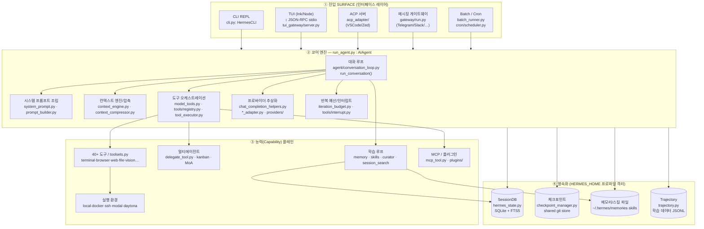
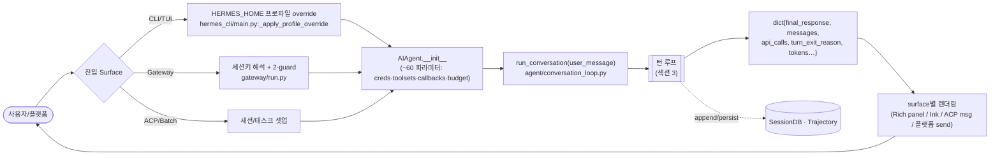
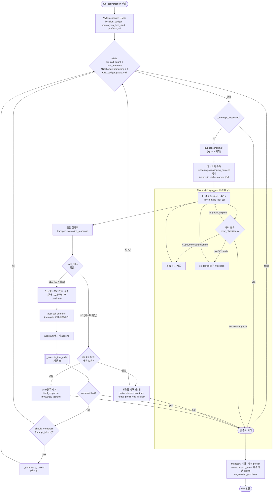
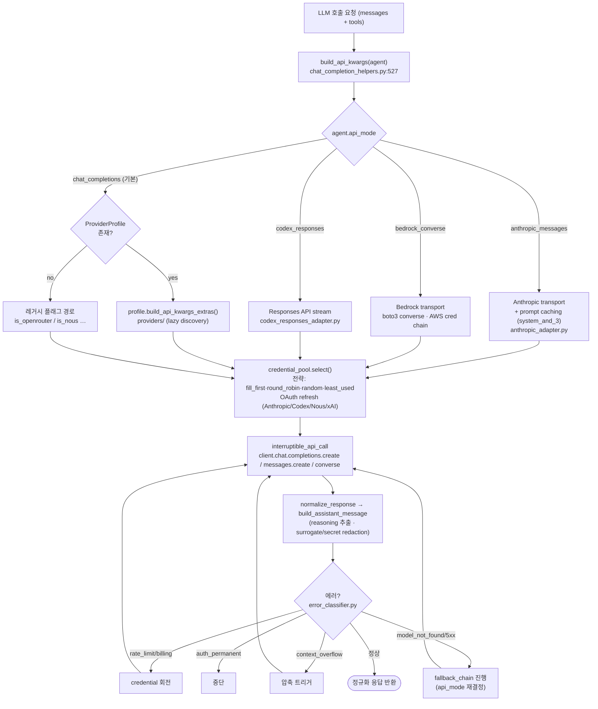
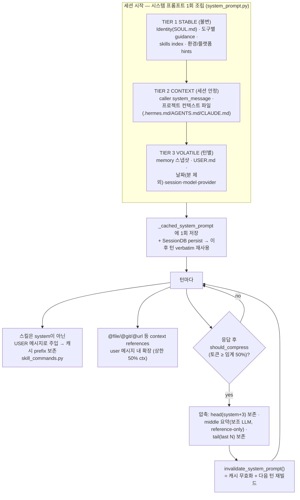
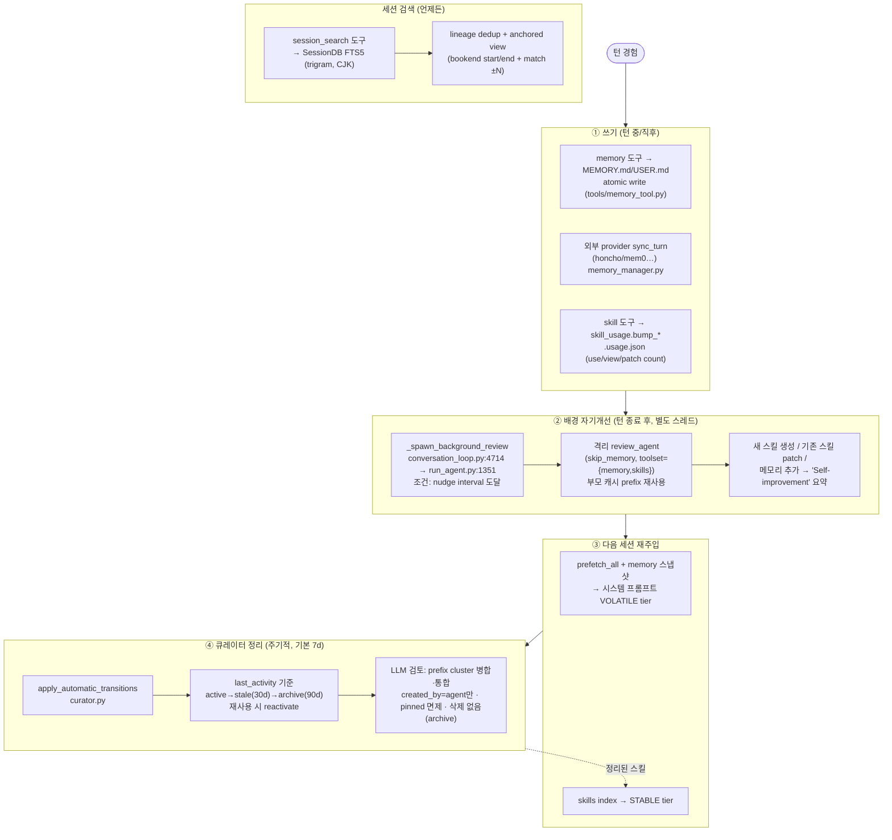
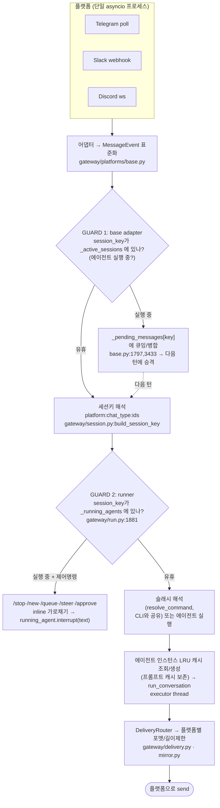

# Hermes Agent — 서비스 아키텍처 도식

> 원본 [`_reference/hermes-agent/`](_reference/hermes-agent/) 전체(Python 2,046+ 파일, `agent/` 코어 ~60k LOC)를
> **구현 클래스가 아니라 서비스 인터페이스 · 동작 흐름 · 제어 흐름** 레벨에서 해부한 도식 모음입니다.
> 각 다이어그램의 노드/엣지는 실제 코드 경로로 교차검증되었으며, 끝에 [검증 표](#10-교차검증-cross-verification)가 있습니다.
>
> 모듈 단위 상세 분석(미러 + demo)은 [`module/`](module/) 폴더 참고. 이 문서는 그것들을 **하나의 제어 흐름으로 잇는 상위 지도**입니다.

목차
1. [전체 서비스 모듈 맵 (한 장)](#1-전체-서비스-모듈-맵)
2. [요청 생애주기 — 진입점에서 응답까지](#2-요청-생애주기--진입점에서-응답까지)
3. [코어 제어 흐름 — 에이전트 턴 루프](#3-코어-제어-흐름--에이전트-턴-루프)
4. [도구 서브시스템 파이프라인](#4-도구-서브시스템-파이프라인)
5. [프로바이더/모델 추상화](#5-프로바이더모델-추상화)
6. [컨텍스트 & 시스템 프롬프트 레이어링](#6-컨텍스트--시스템-프롬프트-레이어링)
7. [닫힌 학습 루프 (Closed Learning Loop)](#7-닫힌-학습-루프)
8. [메시징 게이트웨이 & 2-Guard 모델](#8-메시징-게이트웨이--2-guard-모델)
9. [멀티에이전트 — 위임 / Cron / Kanban](#9-멀티에이전트--위임--cron--kanban)
10. [교차검증 (Cross-Verification)](#10-교차검증-cross-verification)
11. [커스터마이징 진입점](#11-커스터마이징-진입점)

---

## 1. 전체 서비스 모듈 맵

Hermes는 **5개 진입 surface → 단일 `AIAgent` 코어 → 3계층 영속화**의 모놀리식 구조다.
핵심은 어떤 surface로 들어오든 결국 `AIAgent.run_conversation()` 하나로 수렴한다는 점.

**레이어별 책임**

| 레이어 | 책임 | 인터페이스 계약 |
|---|---|---|
| ① Surface | 입력 수집 + 출력 렌더링 | 각자 `AIAgent` 인스턴스화 → `run_conversation(msg)` 호출 |
| ② Core | 턴을 응답으로 변환 (모델 호출 ↔ 도구 실행 루프) | `run_conversation(user_message) -> dict{final_response, messages, …}` |
| ③ Capability | 에이전트의 "손발" — 도구·환경·서브에이전트·학습·MCP | 모든 도구 핸들러는 **JSON string 반환** 규약 |
| ④ Persist | 세션·파일변경·메모리·학습데이터 영속 | 전부 `get_hermes_home()` 경유 → 프로파일 자동 격리 |

---

## 2. 요청 생애주기 — 진입점에서 응답까지

5개 surface가 공유하는 **공통 코어 진입**과 surface별 차이.

**공통점 vs 차이점**

- **공통:** 전부 `AIAgent` 단일 클래스를 인스턴스화하고 `run_conversation()`을 호출한다. 도구/프롬프트/프로바이더/압축 로직은 surface와 무관하게 동일.
- **차이:**
  - CLI/TUI → 프로세스 cwd 사용, `SessionDB` 영속, 인터랙티브 승인 콜백.
  - Gateway → `terminal.cwd` 사용, 세션키(`platform:chat:user`) 라우팅, 에이전트 인스턴스 LRU 캐싱(프롬프트 캐시 보존).
  - Batch/Cron → `SessionDB` 미사용, trajectory 위주, 비대화형 auto-approve.
  - TUI → Node(Ink)가 화면, Python이 세션/도구/모델. 경계는 newline-delimited JSON-RPC.

---

## 3. 코어 제어 흐름 — 에이전트 턴 루프

심장. `agent/conversation_loop.py:796`의 단일 while 루프.
AGENTS.md가 요약한 `while count < max: call; if tools: exec; else return`은 **개념적으로 맞지만**,
실제론 예산·인터럽트·재시도·압축·빈응답복구가 추가된 견고한 버전이다.

**핵심 인터페이스**

- 입력: `run_conversation(user_message, system_message=None, conversation_history=None, task_id=None)`
- 출력 dict 주요 키: `final_response`, `messages`(OpenAI 포맷), `api_calls`, `completed`, `turn_exit_reason`, `interrupted`, `input/output_tokens`, `estimated_cost_usd`.
- 메시지 role: `system` / `user` / `assistant` / `tool`. reasoning은 `assistant_msg["reasoning"]`에 저장하되 API 전송 시 `reasoning_content`로 복사하고 trajectory용 원본은 보존.
- **인터럽트:** thread-scoped 전역(`tools/interrupt.py`의 `_interrupted_threads`). 루프 시작·백오프 대기 중 체크되어 즉시 탈출. 게이트웨이/CLI가 외부에서 `set_interrupt(tid)` 호출.

---

## 4. 도구 서브시스템 파이프라인

발견 → 노출 → 호출 → 실행 → 결과의 5단계. "행동 레이어".

```mermaid
flowchart TD
    subgraph DISCOVER["A. 자동 발견 (import time)"]
        D1["discover_builtin_tools()<br/>tools/registry.py:57<br/>AST로 registry.register 호출하는 tools/*.py만 import"]
        D1 --> D2["registry.register(name, toolset, schema,<br/>handler, check_fn, requires_env)<br/>→ ToolEntry 저장 + generation++"]
    end

    subgraph EXPOSE["B. 스키마 노출 (턴 시작)"]
        E1["get_tool_definitions(enabled, disabled)<br/>model_tools.py:264"]
        E1 --> E2["resolve_toolset() 재귀 확장<br/>toolsets.py:TOOLSETS / _HERMES_CORE_TOOLS"]
        E2 --> E3["check_fn() 통과 도구만 필터<br/>(30s TTL 캐시: docker·modal·playwright 가용성)"]
        E3 --> E4["동적 후처리: execute_code·discord·<br/>browser 스키마 재구성 / 스키마 sanitize"]
        E4 --> E5["Tool Search 점진공개:<br/>MCP/플러그인 도구가 컨텍스트 ~10% 초과 시<br/>3개 bridge 도구로 대체"]
    end

    subgraph DISPATCH["C. 호출 디스패치"]
        F0["LLM이 tool_call 생성"]
        F0 --> F1{"_AGENT_LOOP_TOOLS?<br/>{todo, memory,<br/>session_search, delegate_task}"}
        F1 -->|yes| AG["에이전트 루프가 직접 처리<br/>tool_executor.py (registry 우회)"]
        F1 -->|no| F2["handle_function_call()<br/>model_tools.py:802"]
        F2 --> F3["coerce_tool_args (타입 드리프트 보정)"]
        F3 --> F4["pre_tool_call 훅 · ACP 편집 승인"]
        F4 --> F5["registry.dispatch()<br/>(async 브리징 · 예외 래핑)"]
        F5 --> F6["post_tool_call · transform_tool_result 훅"]
    end

    subgraph EXECUTE["D. 실행 (tool_executor.py)"]
        X1{"배치 병렬 가능?<br/>_should_parallelize"}
        X1 -->|"safe subset"| X2["ThreadPool (≤8) 동시 실행"]
        X1 -->|"unsafe/경로충돌"| X3["순차 실행"]
        X2 & X3 --> X4["guardrail.before_call<br/>(루프/스타베이션 감지)"]
        X4 --> X5["destructive 도구 전 체크포인트<br/>(write_file·patch·terminal)"]
    end

    subgraph RESULT["E. 결과 후처리 (3계층 크기 방어)"]
        R1["guardrail observation 주입"]
        R1 --> R2["Layer2: 결과>상한 → 샌드박스 파일로 spill<br/>(read_file로 접근)"]
        R2 --> R3["Layer3: 턴 누적>200K → 최대 결과 디스크 이동"]
        R3 --> R4["멀티모달 언랩 → tool 메시지 조립<br/>role=tool, tool_call_id"]
    end

    D2 -.generation.-> E1
    E5 --> F0
    AG & F6 --> X1
    X5 --> R1
    R4 --> OUT([messages에 append])
```

**계약 & 확장점**

- **핸들러 규약:** 모든 도구 핸들러는 JSON string 반환 (`tool_result()` / `tool_error()`).
- **신규 도구 추가:** 코어는 2파일(`tools/your_tool.py` + `toolsets.py` 등록), 로컬은 플러그인(`~/.hermes/plugins/`)에서 `ctx.register_tool()`.
- **플러그인 훅:** `pre_tool_call` / `post_tool_call` / `transform_tool_result` (도구), `pre/post_llm_call` · `on_session_start/end` (생명주기).
- **에이전트 레벨 도구**(todo·memory·session_search·delegate_task)는 registry를 우회하여 `tool_executor.py`에서 직접 처리 — 에이전트 상태(todo_store·memory_store)에 접근해야 하기 때문.

---

## 5. 프로바이더/모델 추상화

"Use any model" 의 실체. `api_mode`로 4갈래 분기하고, ProviderProfile/credential pool로 라우팅.

**메인 모델 vs 보조(Auxiliary) 모델 분리**

- 메인 턴은 위 경로. **압축 요약·세션검색·비전·제목생성** 등 side-LLM 작업은 `agent/auxiliary_client.py:_resolve_auto`가 **별도 라우팅 체인**으로 해석(메인 provider → OpenRouter → Nous Portal → custom → Anthropic → 직접키 providers 순). `config.yaml`의 `auxiliary` 섹션으로 작업별 provider/model 오버라이드.
- **api_mode 결정 규칙:** provider ID(`openai-codex`/`anthropic`/`bedrock`) → base_url 패턴(`/anthropic`, `bedrock-runtime`) → model+provider 규칙(`_provider_model_requires_responses_api`).

---

## 6. 컨텍스트 & 시스템 프롬프트 레이어링

프롬프트 캐시를 깨지 않는 것이 최우선 불변식. 3-tier로 조립하고 압축만이 유일한 변경 지점.

**캐시 불변식 (정책으로 강제)**

> 대화 중간에 과거 컨텍스트 변경 / 도구셋 변경 / 메모리·시스템프롬프트 재빌드 **금지**.
> 컨텍스트를 바꾸는 유일한 합법 시점은 **압축**뿐.

- 스킬을 system이 아닌 user 메시지로 주입 → prefix 캐시 안전.
- volatile tier는 날짜를 **분 단위가 아닌 일 단위**로 찍어 하루 동안 바이트 안정 유지.
- 슬래시 명령으로 system 상태를 바꾸는 건 기본 deferred(다음 세션 반영), `--now`로만 즉시 무효화.
- 런타임 압축 ≠ trajectory 압축. 전자는 대화 연속성 보존(`context_compressor.py`), 후자는 학습 데이터 압축(`trajectory_compressor.py`).

---

## 7. 닫힌 학습 루프

Hermes의 핵심 차별점. 4개 채널(메모리·스킬생성·스킬개선·세션검색)이 "경험 → 저장 → 재주입 → 정리"를 형성.

**4채널 인터페이스 요약**

| 채널 | 쓰기 | 읽기(재주입) | 정리 |
|---|---|---|---|
| 메모리 | `memory(add/replace/remove)` → 파일 atomic | 세션시작 스냅샷 → VOLATILE tier | (해당없음, 사용자/에이전트 관리) |
| 스킬 생성 | 배경 리뷰가 `skill_manage(create)` | skills index → STABLE tier | 큐레이터 stale/archive |
| 스킬 개선 | 사용 중 `skill_manage(patch)` + telemetry | 로드 시 user 메시지 | 큐레이터 prefix 병합 |
| 세션 검색 | 모든 메시지 자동 FTS5 인덱싱 | `session_search(query)` on-demand | (lineage 압축 chain) |

**불변식:** 큐레이터는 `created_by="agent"` 스킬만 건드림(번들/Hub 면제), pinned 면제, **절대 삭제 안 함**(archive만, 복구 가능).

---

## 8. 메시징 게이트웨이 & 2-Guard 모델

단일 프로세스에서 다수 플랫폼 어댑터를 asyncio로 동시 운영. 실행 중 메시지를 다루는 **두 개의 guard**가 핵심.

**왜 guard가 두 개인가**

- **GUARD 1 (base adapter):** 느린 네트워크/연속 전송 대비. 실행 중 도착한 메시지를 세션당 단일 슬롯에 **병합 큐잉**하여 다음 턴에 자동 연결.
- **GUARD 2 (runner):** 빠른 사용자 제어. `/stop`·`/approve` 등은 에이전트가 블록된 상태에서도 **즉시** 닿아야 하므로 `_process_message_background()`를 거치지 않고 inline 디스패치. (AGENTS.md 경고: 새 제어 명령은 두 guard 모두 우회해야 함.)
- 세션 격리: `session_key`별 asyncio.Event로 동일 세션 동시실행 방지, 다른 세션은 병렬.
- cron/배경작업 결과는 메인 세션에 섞지 않고 **자체 세션**에 header/footer 프레임으로 전달(role 교대 보존).

---

## 9. 멀티에이전트 — 위임 / Cron / Kanban

작업을 턴 밖으로 내보내는 3경로. **동기/내구(durable) 성격이 다르다.**

```mermaid
flowchart TD
    subgraph DEL["① delegate_task (동기, in-process)"]
        DP["부모 에이전트 tool 호출<br/>tools/delegate_tool.py:1918"]
        DP --> DB["_build_child_agent: 격리 AIAgent<br/>toolset = 부모 ∩ 요청 (권한상승 불가)<br/>skip_memory·skip_context·자체 system prompt"]
        DB --> DR{"단일 / 배치?"}
        DR -->|단일| DS["_run_single_child (블로킹)<br/>hard timeout 600s · heartbeat 30s"]
        DR -->|배치| DM["ThreadPool ≤ max_concurrent_children(3)<br/>부모 interrupt → pending 자식 cancel"]
        DS & DM --> DSUM["summary JSON 반환 → 부모 루프 재개"]
    end

    subgraph CRON["② cron (내구, 부모 없음)"]
        CT["scheduler.tick (gateway 60s / daemon)<br/>cron/scheduler.py · .tick.lock"]
        CT --> CD["get_due_jobs → run_job"]
        CD --> CR2{"no_agent script?"}
        CR2 -->|yes| CSC["subprocess 실행 (stdout=결과)"]
        CR2 -->|no| CAG["AIAgent 생성 → run_conversation<br/>3분 hard interrupt · skip_memory"]
        CSC & CAG --> CDLV["결과 파일 저장 + 플랫폼 delivery<br/>advance_next_run"]
    end

    subgraph KAN["③ kanban (내구, 큐 기반)"]
        KT["dispatcher tick (60s, gateway 내장)<br/>hermes_cli/kanban.py"]
        KT --> KR["stale claim 회수 → ready 승격 →<br/>atomic claim → 워커 profile 스폰"]
        KR --> KW["워커 AIAgent<br/>HERMES_KANBAN_BOARD/TASK env 고정<br/>board=하드경계, tenant=소프트 네임스페이스"]
        KW --> KL["kanban_complete/block/heartbeat<br/>자기 task만 수정 가능"]
        KL --> KEND["task.status 전환 (DB)<br/>2회 연속 실패 시 auto-block"]
    end
```

| 경로 | 동기성 | 부모 | 격리 | 결과 회수 | 인터럽트 | 용도 |
|---|---|---|---|---|---|---|
| delegate_task | **동기** (부모 블로킹) | 있음 | 스레드 + toolset 교집합 | JSON 반환 | 부모→자식 전파 | 현재 턴 내 병렬 워크스트림 |
| cron | 내구 (serial tick) | 없음 | 프로세스/프로파일 | 파일 | job disable / 3분 컷 | 스케줄 자동화 |
| kanban | 내구 (큐) | 없음 | board+profile+tenant | DB row | claim 만료→ready 복귀 | 다중 워커 협업 |

**부가:** `code_execution`은 RPC(UDS/파일)로 샌드박스 스크립트가 도구를 호출하게 해 멀티스텝을 "zero-context-cost turn"으로 압축. `mixture_of_agents`는 N개 레퍼런스 모델 병렬 → aggregator 합의.
**전역 상태 주의:** `_last_resolved_tool_names`(process-global)를 자식 실행 전후로 저장/복원 — `execute_code`가 노출 도구 결정에 이 값을 읽기 때문.

---

## 10. 교차검증 (Cross-Verification)

8개 서브시스템을 병렬 탐색 후, 핵심 주장을 원본 코드 `grep`으로 직접 재확인함.

| # | 주장 | 검증 위치 | 결과 |
|---|---|---|---|
| 1 | 메인 루프 = budget+grace+interrupt 포함 | `agent/conversation_loop.py:796` | ✅ `while (count<max AND budget.remaining>0) or _budget_grace_call` |
| 2 | 에이전트 레벨 도구는 registry 우회 | `model_tools.py:556,915` | ✅ `_AGENT_LOOP_TOOLS={todo,memory,session_search,delegate_task}` |
| 3 | api_mode 4분기 | `chat_completion_helpers.py:186/198/200/568` | ✅ codex_responses/anthropic_messages/bedrock_converse/chat_completions |
| 4 | 도구 자동발견 = AST 스캔 | `tools/registry.py:57` | ✅ `discover_builtin_tools()` |
| 5 | toolset 단일 dict + 코어 번들 | `toolsets.py:88, 31` | ✅ `TOOLSETS`, `_HERMES_CORE_TOOLS` |
| 6 | 위임 기본 flat(깊이1), clamp[1,3] | `tools/delegate_tool.py:133,394` | ✅ `MAX_DEPTH=1`, `_get_max_spawn_depth` |
| 7 | 배경 자기개선 = 별도 스레드 spawn | `conversation_loop.py:4714` → `run_agent.py:1351` | ✅ nudge 조건부 `_spawn_background_review` |
| 8 | 게이트웨이 2-guard | `base.py:1797,3433` + `run.py:1881` | ✅ `_pending_messages` / `_running_agents` |

**AGENTS.md ↔ 실제 코드 차이 (주목할 점)**

- AGENTS.md의 루프 의사코드는 단순화본. 실제론 iteration budget·grace call·인터럽트·다단계 재시도·빈응답 5단계 복구·자동 압축이 추가됨 (섹션 3).
- AGENTS.md는 `run_agent.py ~12k LOC`라 적었으나 이 스냅샷은 4,831 LOC, `cli.py`는 15,847 LOC — 버전 차이(트리는 "정확하지 않을 수 있다"고 명시됨). 실제 코어 로직 다수가 `agent/conversation_loop.py`(258KB)로 분리되어 있음.
- `_AGENT_LOOP_TOOLS`에 `clarify`는 미포함(초기 추정과 달리 4개뿐) — 코드 확인으로 정정됨.

---

## 11. 커스터마이징 진입점

> 목적이 "최종적으로 커스텀"이므로, 위 도식에서 **건드릴 수 있는 안전한 확장점**을 레이어별로 정리.

| 커스텀 목표 | 진입점 | 코어 수정 필요? |
|---|---|---|
| 새 도구 추가 | `~/.hermes/plugins/<name>/` + `ctx.register_tool()` | ❌ (플러그인) |
| 도구 호출 가로채기/변형 | 플러그인 훅 `pre/post_tool_call`, `transform_tool_result` | ❌ |
| 새 모델 provider | `plugins/model-providers/<name>/` + `register_provider(ProviderProfile)` | ❌ (last-writer-wins 오버라이드) |
| 메모리 백엔드 교체 | 신규 플러그인 repo, `MemoryProvider` ABC 구현 | ❌ (in-tree 추가는 정책상 금지) |
| 압축 전략 교체 | `plugins/context_engine/` + `ContextEngine` ABC | ❌ |
| 시스템 프롬프트 변경 | `~/.hermes/SOUL.md`(identity), 프로젝트 `AGENTS.md/.hermes.md`(context) | ❌ |
| 도구셋 구성 | `config.yaml` `tools.<platform>.enabled/disabled` 또는 `hermes tools` | ❌ |
| CLI 테마/브랜딩 | `~/.hermes/skins/<name>.yaml` (순수 데이터) | ❌ |
| 새 메시징 플랫폼 | `gateway/platforms/` 어댑터 (ADDING_A_PLATFORM.md) | ⚠️ (어댑터 추가) |
| 턴 루프 로직 변경 | `agent/conversation_loop.py` | ✅ (코어) |
| 새 슬래시 명령 | `hermes_cli/commands.py` COMMAND_REGISTRY + `cli.py`/`gateway/run.py` 핸들러 | ✅ (코어, 3~4파일) |

**핵심 제약:** 프롬프트 캐시 불변식(섹션 6)과 프로파일 경로 규칙(`get_hermes_home()` 사용, `~/.hermes` 하드코딩 금지)을 깨지 않을 것. 플러그인은 코어 파일(`run_agent.py`/`cli.py`/`gateway/run.py`)을 수정해선 안 되며, 부족하면 일반 훅/ctx 메서드를 확장하는 방향(정책).

---

*생성: 8개 서브시스템 병렬 정밀 탐색 + 원본 코드 직접 grep 교차검증. 라인 번호는 `_reference/hermes-agent/` 스냅샷 기준이며 버전에 따라 이동할 수 있음.*
